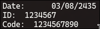
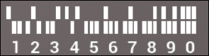

# Rivage_Speedrun_Any
This page contains a guide and python script for Any% speedrunning the game Rivage

## Game settings
I have the in-game FPS counter enabled to notate when time should start 
I also run them game in windowed mode so I can have the script output visible off to the side

## Menu Loop
To save time on the loop you can press escape and quit to main menu, 
Once on the main menu click Continue
This will trigger a new loop instead of having to use the arcade

## Guide
When you start a new game during the opening cutscene run the script, it will display the following information
- Miranda's Birthdate
- LVL 5 ID Number
- LVL 5 Badge Code
	- Script Output Example
   - 

- Skip the cutscene and time starts with the FPS counter displays in the upper left corner
### LVL 1 Split:
- Go to the safe in Miranda's room and input /000/ and press ok
- Next enter the birthdate listed in the script output
- After you open the safe and scan the barcode the split ends when it's added to your K9
### Pod Access split:
- Leave your room and enter the main area
- Grab the first key on the lounge area
- Go up to the kitchen and enter the below code to unlock the terminal
	- 
- Select the robot area
- Move down to the robot area and insert the first key into the pharmacy terminal
- Pick up the key on the desk in the robot area
- Insert it in the pharmacy terminal
- Go back to the kitchen terminal and select the Cultivation area
- Go up the stairs and grab the final key next to the locked chest on the desk
- Go back to the kitchen terminal and select the robot area again
- Insert the final key and pull down the level
- Once the screen is active select the pod bay access
- Scan the code and once it's added to your K9 perform a menu loop
- Once the FPS counter reappears that marks your split
### LVL 5 Split:
- Leave your room and enter the pod access room
- Go to the kitchen terminal, unlock it and select the cultivation room
- Go to the terminal and type in the LVL 5 ID number from the script output
- Using the below guide enter the LVL 5 Code displayed on the output
	- 
- Open the card containter
- Now go to miranda's locker and grab the key
- Modify the key so the middle part is straight up and the bottom part (closest to the handle) is opposite the first two
- Run back to the cultivation room and insert the key in the locked chest
- Retrieve the broken card and insert it into the pod bay terminal
- Click Print Card and once it's printed scan the code on the back
- When it's added to your K9 perform a menu loop
- Once the FPS counter reappears that marks your split
### Escape
- Leave your room and go to Jonny's room
- Walk through the portal
- Go up to the Fusion Core Terminal
- Select pods, and unlock pod 1
- Pull down the Lever and go back through the portal
- Run back to the pod access room
- Time stops when you click open on the pod
