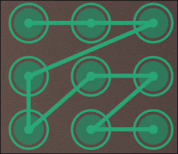

# Rivage Speedrun Any%
This page contains a guide for speedrunning the Any% category for the game Rivage
I will assume that you have completed the game at least once and know where the main puzzles are in the game.
## Game settings
I have the in-game FPS counter enabled to notate when time should start and to trigger splits.
## Menu Loop
To save time on the loop you can press escape and quit to main menu, 
Once on the main menu click Continue
This will trigger a new loop instead of having to use the arcade
(you can press escape after quitting to skip the black screens and during the wake-up sequence to skip it.)

## Guide
- Start a new game and skip the cutscene. 
- Time starts with the FPS counter displays in the upper left corner

### Pod Access split - 1:39.212
- Go to the safe in Miranda's room and input /000/ and press ok
- Next enter her birthday from the back of her book
- Grab and scan her card
- Leave your room and enter the main area
- Grab the first key on the lounge area
- Go up to the kitchen and enter the below code to unlock the terminal
	- 
- Select the robot area
- Move down to the robot area and insert the first key into the pharmacy terminal
- Pick up the key on the desk in the robot area
- Insert it in the pharmacy terminal
- Go back to the kitchen terminal and select the Cultivation area
- Go up the stairs and grab the final key next to the locked chest on the desk
- Go back to the kitchen terminal and select the robot area again
- Insert the final key and pull down the level
- Once the screen is active select the pod bay access
- Scan the code and once it's added to your K9 perform a menu loop
- Once the FPS counter reappears that marks your split

### Lvl 2 Split - 1:34.559
- Leave your room and switch to the Cultivation area
- Grab the key from Miranda's locker
- Run back to the cultivation area and fix the key (4 presses on the middle and 6 on the back)
- unlock the chest and grab Amman's card
- look at the card ID and remember it
- run to the card printer in the pod bay
- enter his ID and fix the code to be:
	- 492 386 127 5
- insert, print, and scan his badge
- once scanned perform a menu loop

### Amman Room - 1:51.471
- leave your room and go to the horizon probe room
- enter the password igorpetrov in the terminal and get the contactless upgrade
- Run to Amman's room and enter the password cosmik!
- open the command-line and type the following commands:
	- ```build hyperviolet.qb ```
	- ```copy flashlight.exe miranda.v ```
	- ```datalens.exe train_components_list.dtl ``` 
		- credit: DragonKarsh
- screenshot the printer cable list and perform a menu loop

### Exnilon - 3:40.956
- head to the vending machine in the pod bay
- use your HV flashlight to unlock the terminal
- click manage stock and enter the following:
	- CP379087
	- CP208674
	- CP687575
- confirm it and add a credit to the vending machine
- enter 024 and scan the multi-pass
- once added enter the garage
- Go up the ladder and grab the Orbit Scout module next to the terminal
- go to the orbital scout and pull the lever
- place the modules in the orbital scout 
- grab the sound pad next to the cube safe before going back up the ladder
- perform the stellar map sequence, I used the following guide (where 1 is the top middle hexagon and it goes clockwise around the circle)
	- 331 112 343 112 666
	- 116 164 451 655 466
	- 434 454 444 221 232
		- *(I know that the first 112 sequence doesn't have a point in the first 1 spot but I memorize better in groups of three)*
		- *I have a practice module you can use in the guides folder called [stellar_practice.html](https://github.com/blurmcclure18/Rivage_Speedrun_Any/guides/stellar_practice.html) you can download the .html file and open it in any browser and practice the sequence*
- once the squence is complete play the sound and run to the lobby
- I prefer to stand in the time slow circle so I can physically write down the numbers for the sequence using this guide: 
	1. 1 - 4
	2. 3 - 1
	3. 2 - 3
	4. 4 - 1
	5. 1 - 3
	6. 3 - 4
	- *when the horizon_particle.wav sequence plays I treat each dot as a number in a spot of 1 - 2 - 3 - 4*
	- *you can just look at the first 2 numbers in the Horizon_Particle.wav sequence to figure out the pad number to press*
- Once you reveal the particle screenshot it and menu loop

### Blueprint (time sensitive) - 2:08.317
- run to the garage and stand on the right side of the incinerator, walk into it and move your cursor around while mashing Q to try and grab the key inside
	- credit: DragonKarsh
- Once you have the key go up the ladder and complete the particle puzzle
- open the email and memorize the Battery code
- Run down to the kitchen, unlock and grab the usb key
- go to the battery case and enter the code
- insert the battery for extra power and run to the lobby computer
- insert the usb drive and cancel the update
- go back and switch the room to the Robot Area
- go to the laptop and screenshot the blueprint

### Jahi ID - 0:43.941
- grab and insert the battery for extra power
- run to the observatory and screenshot Jahi's ID

### Fingerprint - 2:55.796
- grab and insert the battery for extra power
- run to the lab door and input the password:
	- chronoservus
- enter the lab and run to the right and pick up the pipe
- scan the fingerprint 
	- *(you might have to turn off HV flashlight and back on for it to let you scan it)*
- check the desk to your right and grab a switch if it's there
- continue to walk around the lab checking the interactible items for fingerprints
	- *you just need 1 from the other items*
	- *take note of the other switch locations as you find them*
- once you find the other Item fingerprint complete the switch puzzle
- for the drawings puzzle you can now follow the blood on the floor and it will take you to each drawing and the place where you input the codes
- once you scan the final fingerprint perform a menu loop

### Jahi Code - 1:46.857
- grab the battery and run to the observatory
- insert the battery and click the fingerprint pad
- complete the floor puzzle using this clip as a guide
	- [Floor Puzzle](https://youtu.be/TdiBVk1WMYQ)
- download/screenshot Jahi's code
- perform a menu loop

### Train Access - 1:42.511
- grab the key and amman's card
- take it to the pod room and create Jahi's card
- go to his locker and grab the train key and scan it
- perform a menu loop

### Dup Key - 0:57.230
- grab the battery and travel to the lobby
- grab the security card and place it in the train
- perform a menu loop

### Dup Gear - 1:20.847
- grab the battery and travel to the lab
- grab the security key and interact with the console
- download the pass, and release the tank
- go down the ladder and grab the bottom left 4 prong gear
- place it on the train
- perform a menu loop

### Cube Pattern - 1:58.131
- go back to the lab
- grab the gear and complete the gear puzzle
- run upstairs and open the container
- while it opens grab the data disk and place it on the train
- screenshot the cube sequence and perform a menu loop

### Print Cable - 3:40.281
- go to the lobby upper terminal
- grab the data disk
- screenshot the password on the wall
- insert the data disk
- decode the sequence using this guide
	- 61 - 6D - 61 - 70
	- 65 - 63
	- 3A - 61 - 6C - 65 - 61
	- 74 - 74 - 69 - 6F - 6E
	- 73 - ???????
- screenshot the cube safe code
- go back to the garage and get the cube
- enter the cube sequence
- scan level 4
- return to the garage
- print the cable
- grab the cable and put it on the train
- perform a menu loop

### Escape - 0:33.872
- Leave your room and go to Jonny's room
- Walk through the portal
- Go up to the Fusion Core Terminal
- Select pods, and unlock pod 1
- Pull down the Lever and go back through the portal
- Run back to the pod access room
- Time stops when you click open on the pod
